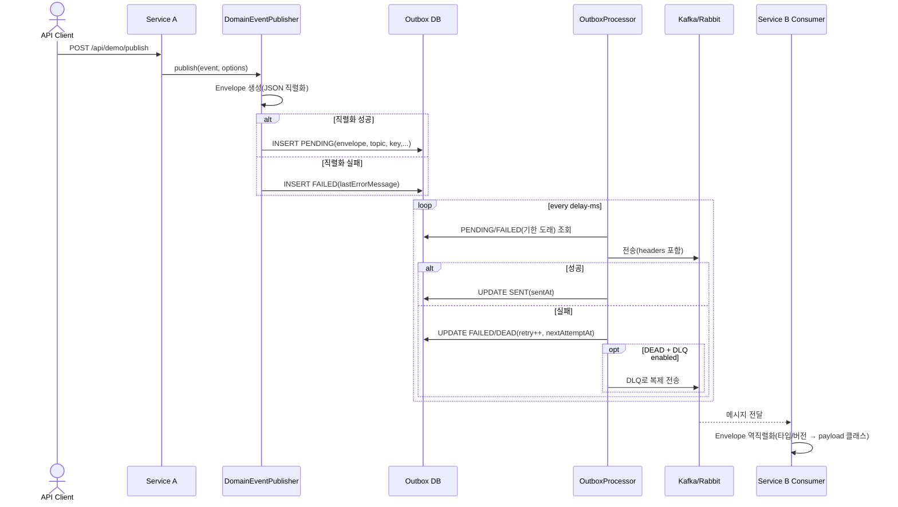

# Infra Messaging Playground — End-to-End 가이드

이 문서는 이 저장소를 클론한 뒤, 로컬 환경에서 Outbox → Broker(Kafka/RabbitMQ) → Consumer 까지 처음부터 끝까지 실제로 동작시키는 방법을 단계별로 안내합니다. 모든 설명은 한국어로 제공되며, 아키텍처/플로우는 다이어그램(Mermaid)으로 함께 제공합니다.

목차
- 프로젝트 개요
- 아키텍처(그림)
- 준비물/사전 요구사항
- 빠른 시작(E2E)
- 설정(application.yaml) 핵심
- 내부 동작(그림: 시퀀스)
- 검증 포인트(로그/DB/헤더)
- 트러블슈팅(FAQ)
- 추가 참고

---

## 프로젝트 개요
도메인 서비스가 브로커(Kafka/RabbitMQ) 세부 구현에 의존하지 않고, 단순한 API로 이벤트를 발행하면,
Messaging Starter가 표준 Envelope(JSON)로 래핑하여 Outbox 테이블에 저장하고, Outbox Processor가 이를 안전하게 브로커로 전달합니다. 재시도/백오프/헤더 주입/DLQ까지 포함합니다.

핵심 요소
- Envelope: id, type, version, occurredAt, producer, trace, routing, payload
- Outbox: 이벤트 JSON 저장(PENDING/FAILED/DEAD/SENT), 재시도/백오프/에러메시지 관리
- Producer: KafkaTemplate/RabbitTemplate 기반 실제 전송(헤더 주입)
- Consumer 샘플: serviceB에서 Kafka/Rabbit 수신 예시 제공

---

## 아키텍처(그림)
```mermaid
flowchart LR
  A[Service A (도메인 코드)] -- publish(event) --> B[DomainEventPublisher]
  B --> C[Envelope(JSON) 생성]
  C --> D[Outbox DB(event_outbox)]
  E[OutboxProcessor (스케줄)] -- 선택 --> D
  E --> F{Broker}
  F -->|Kafka| G[(Kafka Topic)]
  F -->|RabbitMQ| H[(Exchange/Routing)]
  G --> I[Service B Consumer]
  H --> I
  E -. 실패/백오프/DEAD .-> J[DLQ 토픽/라우팅]
```

---

## 준비물/사전 요구사항
다음 중 하나의 브로커를 준비하세요(둘 다 준비해도 무방).
- Kafka: 로컬 브로커(예: Docker, Confluent Platform, Redpanda) — 본 가이드는 localhost:9093 기준
- RabbitMQ: 로컬 브로커 — 본 가이드는 localhost:5672 기준
- DB: H2(메모리) 기본 설정으로 Outbox 동작 확인 가능(서비스 A에서 JPA auto DDL update 사용)
- JDK 21+ (프로젝트 설정은 Java 24 toolchain, Gradle가 자동 설치)

참고: 로컬 브로커 예시 Docker Compose(옵션)
```yaml
# docker-compose.kafka.yml (예시)
services:
  zookeeper:
    image: bitnami/zookeeper:3.9
    environment:
      - ALLOW_ANONYMOUS_LOGIN=yes
    ports: ["2181:2181"]
  kafka:
    image: bitnami/kafka:3.7
    environment:
      - KAFKA_CFG_ZOOKEEPER_CONNECT=zookeeper:2181
      - ALLOW_PLAINTEXT_LISTENER=yes
      - KAFKA_CFG_LISTENERS=PLAINTEXT://:9092,PLAINTEXT_HOST://:9093
      - KAFKA_CFG_ADVERTISED_LISTENERS=PLAINTEXT://kafka:9092,PLAINTEXT_HOST://localhost:9093
    ports: ["9093:9093"]
    depends_on: [zookeeper]
```

```yaml
# docker-compose.rabbit.yml (예시)
services:
  rabbitmq:
    image: rabbitmq:3-management
    ports:
      - "5672:5672"
      - "15672:15672" # 관리 UI
    environment:
      - RABBITMQ_DEFAULT_USER=guest
      - RABBITMQ_DEFAULT_PASS=guest
```

---

## 빠른 시작(E2E)
1) 저장소 클론 및 빌드
- 클론: `git clone <repo-url>`
- 루트에서 빌드: `./gradlew build` (성공해야 합니다)

2) 브로커 준비
- Kafka만 사용하려면 Kafka만 기동, Rabbit만 사용하려면 Rabbit만 기동, 둘 다 확인하려면 둘 다 기동합니다.
- 본 가이드는 기본적으로 Kafka 토픽 `user.profile.updated.v1` 과 `user.activity.logged.v1` 를 사용합니다.

3) Service A 실행(Producer + OutboxProcessor 활성화)
- 설정 파일: `services/serviceA/src/main/resources/application.yaml`
- 실행: `./gradlew :services:serviceA:bootRun`
- 포트: 8080

4) Service B 실행(Consumer 전용)
- 설정 파일: `services/serviceB/src/main/resources/application.yaml`
- 실행: `./gradlew :services:serviceB:bootRun`
- 포트: 8081

5) 이벤트 발행(HTTP)
- 단건 발행(Kafka로):
```
curl -X POST http://localhost:8080/api/demo/publish \
  -H 'Content-Type: application/json' \
  -d '{
        "broker":"KAFKA",
        "topic":"user.profile.updated.v1",
        "version":1,
        "userId":"user-1",
        "payload":{"name":"Alice","age":31}
      }'
```
- 양 브로커 동시 발행(Kafka + Rabbit):
```
curl -X POST http://localhost:8080/api/demo/publish-both \
  -H 'Content-Type: application/json' \
  -d '{
        "topic":"user.profile.updated.v1",
        "rabbitExchange":"user.events",
        "rabbitRoutingKey":"user.profile.updated",
        "version":1,
        "userId":"user-1",
        "payload":{"name":"Bob","age":29}
      }'
```
- 다건 발행(여러 토픽/라우팅키):
```
curl -X POST http://localhost:8080/api/demo/publish-multi \
  -H 'Content-Type: application/json' \
  -d '{
        "kafkaTopics":["user.profile.updated.v1","user.activity.logged.v1"],
        "rabbitExchange":"user.events",
        "rabbitRoutingKeys":["user.profile.updated","user.activity.logged"],
        "version":1,
        "userId":"user-2",
        "payload":{"action":"login","ts":1234567890}
      }'
```

6) 기대 결과
- Service A 로그: OutboxProcessor가 주기적으로 PENDING → SENT 전이를 로그로 출력
- Service B 로그: Kafka Demo Consumer가 Envelope를 수신하고 payload를 출력
- 실패 시 재시도/백오프 로그 확인, DEAD 전이 시 DLQ 전송 로그 확인(Outbox.dead-letter.enabled=true인 경우)

---

## 설정(application.yaml) 핵심
Service A(발행 + 프로세서)
```yaml
spring:
  kafka:
    bootstrap-servers: localhost:9093
  rabbitmq:
    host: localhost
    port: 5672
    username: guest
    password: guest
outbox:
  enabled: true
  schedule:
    delay-ms: 1000
messaging:
  type: KAFKA  # 또는 RABBIT
  tracing:
    propagation: true
```

Service B(컨슈머)
```yaml
outbox:
  enabled: false
messaging:
  type: KAFKA  # 컨슈머 데모는 현재 Kafka 리스너와 Rabbit 리스너 예제가 각각 존재
```

Dead-letter 예시(옵션)
```yaml
outbox:
  dead-letter:
    enabled: true
    kafka-suffix: ".DLQ"
    rabbit-suffix: ".dlq"
```

---

## 내부 동작(그림: 시퀀스)


---

## 검증 포인트(로그/DB/헤더)
- Outbox 상태 전이: PENDING → SENT, 실패 시 FAILED/DEAD 및 retry_count, nextAttemptAt 확인
- 헤더 주입(Producer):
  - X-Event-Type, X-Event-Version, X-Trace-Id, X-Occurred-At, X-Producer-Service
  - DEAD → DLQ 시 X-Dead-Letter, X-DLQ-Reason 추가
- Consumer 수신: serviceB의 KafkaDemoConsumer 로그에서 Envelope.type/version/payload 확인

Outbox 테이블(예시 컬럼)
- status, retry_count, next_attempt_at, last_error_message, sent_at, broker_type, kafka_topic, rabbit_exchange, rabbit_routing_key, message_key, envelope

---

## 트러블슈팅(FAQ)
- Kafka 메시지가 안 보임
  - bootstrap-servers(9093) 확인, 토픽 존재 여부 확인, 컨슈머 그룹 로그 확인
- Rabbit 수신이 안 됨
  - exchange/routingKey/queue 바인딩 확인, 기본 자격증명(guest/guest) 확인
- 직렬화 실패
  - Outbox에 FAILED로 기록(Envelope JSON null), lastErrorMessage로 원인 파악
- 재시도/DEAD가 동작하지 않음
  - outbox.enabled=true, delay-ms 확인, max-attempts/백오프 설정 확인
- DLQ가 동작하지 않음
  - outbox.dead-letter.enabled=true, suffix 설정 확인

---

## 추가 참고
- 상세 개념/체크리스트/FAQ 확장은 HELP.md에서 확인하세요.
- 모듈 위치
  - common/event: API(Envelope, Routing, DomainEventPublisher 등)
  - common/infra-messaging: Producer, 역직렬화 유틸리티, AutoConfig
  - common/outbox: Outbox 엔티티/리포지토리/프로세서/오토설정
  - services/serviceA: 데모 발행/REST
  - services/serviceB: 데모 컨슈머


---

## E2E 예시: 발행자/소비자 — 사용자 등록 페이로드(userId, email, userNumber, regCode)

이 섹션은 발행자가 원하는 필드 4개를 포함한 이벤트를 어떻게 발행하고, 소비자가 이를 어떻게 타입 안전하게 파싱하는지 전체 흐름을 보여줍니다.

- 이벤트 타입: UserRegisteredEvent
- 버전: 1
- 페이로드 필드: String userId, String email, Long userNumber, Long regCode

### 1) 발행자(Service A)
REST 엔드포인트: POST /api/demo/publish-user

샘플 요청(JSON)
```
POST http://localhost:8080/api/demo/publish-user
Content-Type: application/json

{
  "broker": "KAFKA",               // 또는 "RABBIT"
  "topic": "user.registered.v1",    // Kafka topic 또는 Rabbit exchange
  "routingKey": "user.registered",  // Rabbit 사용 시
  "userId": "U-1001",
  "email": "user1001@example.com",
  "userNumber": 7777,
  "regCode": 42
}
```

Service A는 위 요청을 받아 다음과 같이 동작합니다.
- 이벤트 타입(type) = "UserRegisteredEvent" 로 Envelope를 생성
- version = 1
- payload = {userId, email, userNumber, regCode} 맵 형태로 JSON 직렬화
- Outbox에 적재(PENDING) → OutboxProcessor가 브로커(Kafka/Rabbit)로 전송

참고: 구현 코드는 services/serviceA/.../DemoController.java 의 /publish-user 메서드와 UserRegisteredEvent 클래스를 보세요.

### 2) 소비자(Service B)
소비자는 수신 시 (type, version) → payload 클래스를 매핑하여, 안전하게 DTO로 역직렬화합니다.

- DTO 클래스: services/serviceB/.../sample/consumer/UserRegisteredPayload.java
```
@Data
public class UserRegisteredPayload {
    private String userId;
    private String email;
    private Long userNumber;
    private Long regCode;
}
```

- 매핑 등록: services/serviceB/.../sample/consumer/PayloadMappingConfig.java
```
@Configuration
@RequiredArgsConstructor
public class PayloadMappingConfig {
    private final EventPayloadRegistry registry;

    @PostConstruct
    public void registerPayloads() {
        registry.register("UserRegisteredEvent", 1, UserRegisteredPayload.class);
    }
}
```

- 컨슈머에서 필드 읽기: services/serviceB/.../KafkaDemoConsumer.java
```
if (env != null && "UserRegisteredEvent".equals(env.getType()) && env.getVersion() == 1 &&
    env.getPayload() instanceof UserRegisteredPayload p) {
    log.info("UserRegisteredEvent 파싱 결과: userId={} email={} userNumber={} regCode={}",
            p.getUserId(), p.getEmail(), p.getUserNumber(), p.getRegCode());
}
```

### 3) 기대 로그 예시
- Service B (KafkaDemoConsumer)
```
[KafkaDemoConsumer] 수신 envelope: type=UserRegisteredEvent version=1 routing=... payloadClass=UserRegisteredPayload (kafkaReceived=1)
[KafkaDemoConsumer] UserRegisteredEvent 파싱 결과: userId=U-1001 email=user1001@example.com userNumber=7777 regCode=42
```

이로써 발행자는 도메인 정보 4개를 payload에 담아 간단히 발행하고, 소비자는 같은 (type, version) 키로 DTO를 등록해 타입 안전하게 값을 획득할 수 있습니다. 다른 이벤트도 동일한 방식으로 DTO와 매핑만 추가하면 쉽게 확장 가능합니다.

---

## 부록: 통합 가이드(HELP.md 병합)

아래 섹션은 기존 HELP.md의 핵심 내용을 본 README에 병합한 것입니다. 이 문서 하나만으로 전체를 이해·운영할 수 있습니다.

### 개발자 API 사용법(요약)
- 발행
  - publisher.publish(CustomEvent event)
  - publisher.publish(CustomEvent event, RoutingOptions opts)
  - (옵션) publisher.publish(List<CustomEvent> events, RoutingOptions opts)
- 소비
  - Kafka: @KafkaListener, Rabbit: @RabbitListener 사용 가능
  - 또는 EventHandler<T>: void handle(Envelope<T> envelope) 패턴 사용
- 비고
  - 서비스 코드는 DomainEventPublisher에만 의존합니다. Envelope 구성/직렬화/Outbox 적재는 스타터가 처리합니다.

### 권장 application.yml 확장 설명
- messaging.type: KAFKA | RABBIT — 기본 브로커 타입을 결정합니다.
- outbox.enabled: true/false — OutboxProcessor 활성화 여부(Producer 측 서비스에서만 true 권장)
- outbox.retry: max-attempts, backoff(base-seconds, max-seconds, jitter-rate)로 재시도 정책을 세밀하게 제어합니다.
- dead-letter.enabled: true 시 DEAD 전이 시점에 DLQ로 복제 전송합니다.
- 예시는 본문 “설정(application.yaml) 핵심” 또는 아래 YAML 샘플을 참고하세요.

```yaml
# 권장 예시(요약)
server:
  port: 8081
spring:
  application:
    name: sample-service
  kafka:
    bootstrap-servers: ${KAFKA_BOOTSTRAP:localhost:9093}
  rabbitmq:
    host: ${RABBIT_HOST:localhost}
    port: ${RABBIT_PORT:5672}
    username: ${RABBIT_USER:guest}
    password: ${RABBIT_PASS:guest}
messaging:
  type: KAFKA
  tracing:
    propagation: true
outbox:
  enabled: true
  batch:
    size: 200
  schedule:
    delay-ms: 1000
  retry:
    max-attempts: 10
    backoff:
      base-seconds: 5
      max-seconds: 300
      jitter-rate: 0.1
  dead-letter:
    enabled: true
    kafka-suffix: ".DLQ"
    rabbit-suffix: ".dlq"
```

### Outbox 동작 핵심 요약
1) publish 호출 → Envelope 생성(JSON 직렬화)
- 성공 시 Outbox에 PENDING 저장, 실패 시 FAILED와 lastErrorMessage 저장
2) OutboxProcessor 주기 처리
- PENDING/FAILED(기한 도래) 조회 → 브로커 전송(헤더 주입)
- 성공: SENT, 실패: retry_count++, nextAttemptAt 계산, DEAD 임계 초과 시 DEAD 전이 및 DLQ 복제(옵션)

### Consumer(수신) 동작 요점
- 수신 시 Envelope(JSON)를 우선 파싱합니다.
- traceId/correlationId는 헤더 및 Envelope.trace로 전파되어, MDC 복원에 사용 가능합니다.
- 역직렬화 실패/핸들러 예외는 브로커별 오류처리 전략을 사용하세요.
  - Kafka: DefaultErrorHandler + DeadLetterPublishingRecoverer 권장
  - Rabbit: RepublishMessageRecoverer 또는 DLX 구성 권장
- 페이로드 클래스 매핑
  - EventPayloadRegistry에 (type, version) → DTO 클래스를 등록하면, 컨슈머에서 자동 역직렬화됩니다.
  - 미등록 시 Map으로 처리됩니다. 예시는 본문 E2E 섹션 참고.

### 관측성(트레이싱/메트릭/로그)
- 트레이싱
  - 요청 처리 시 MDC(traceId, correlationId)를 설정하고 Envelope.trace로 전파합니다.
  - 전송 시 Kafka/Rabbit 헤더에 traceId 등 주요 헤더를 주입합니다.
- 메트릭(예: Micrometer 가정)
  - outbox_processed_total, outbox_failed_total, outbox_dead_total, backlog_gauge,
    processing_latency_histogram 등 지표를 수집하도록 구성 권장
- 로그
  - Envelope id/type/version/traceId/topic/exchange/status를 구조적으로 로깅 권장

### 테스트 및 검증 절차
1) 단위 테스트
- Envelope 빌드, 직렬화/역직렬화, RoutingOptions 적용 테스트
2) 통합(E2E) 테스트
- Testcontainers로 DB + Kafka/Rabbit을 띄워 Outbox → Broker → Consumer 전체 검증
3) 실패 시나리오
- 직렬화 실패 시 FAILED/lastErrorMessage 기록 확인
- 브로커 장애 시 재시도/nextAttemptAt/DEAD 전이 확인, DLQ 복제 동작 확인
4) 부하 테스트
- batch.size/스케줄, 동시성, 지연/처리량을 측정하여 튜닝

### 마이그레이션/적용 가이드(요약)
1) 스키마 확장: event_outbox 테이블(envelope, sent_at, message_key 등 필드)
2) 발행 전환: 기존 직접 Producer 호출 → DomainEventPublisher로 대체
3) Processor 적용: Envelope 기반 OutboxProcessor 활성화
4) Consumer 변경: Envelope 우선 파싱(전환 기간 레거시 포맷 병행 가능)
5) 관측/알람: 메트릭/로그/알람 구성 후 레거시 정리

### 운영 체크리스트(요약)
- Outbox INSERT 후 SENT로 전이되는가?
- 직렬화 실패가 FAILED로 남고 lastErrorMessage가 기록되는가?
- retry_count/nextAttemptAt가 지수 백오프 + 지터 정책대로 증가하는가?
- DEAD 시 DLQ로 복제 전송되는가?(옵션)
- Kafka 전송 시 message_key가 전달되는가?(파티셔닝/순서 보장)
- traceId 헤더가 전파되고 Consumer에서 MDC 복원이 가능한가?

### 문제해결(FAQ) 보강
- 이벤트가 소비되지 않을 때
  - Kafka: 토픽/파티션/컨슈머 그룹 확인
  - Rabbit: exchange/queue/routingKey 바인딩 확인
  - 컨슈머가 Envelope 포맷을 사용 중인지 확인
- 중복 전송
  - Processor 동시 처리 제어(ShedLock/락) + Kafka idempotence(acks=all, enable.idempotence=true) 고려

### 추가 참고자료
- Spring Kafka: https://docs.spring.io/spring-boot/3.5.4/reference/messaging/kafka.html
- Spring AMQP: https://docs.spring.io/spring-boot/3.5.4/reference/messaging/amqp.html
- Spring Data JPA: https://docs.spring.io/spring-boot/3.5.4/reference/data/sql.html#data.sql.jpa-and-spring-data
- Messaging with RabbitMQ: https://spring.io/guides/gs/messaging-rabbitmq/
- Accessing Data with JPA: https://spring.io/guides/gs/accessing-data-jpa/

> 주의: 본 README는 HELP.md의 내용을 병합하여 완성본으로 제공됩니다. 최신 정보는 이 파일을 기준으로 확인하세요.
